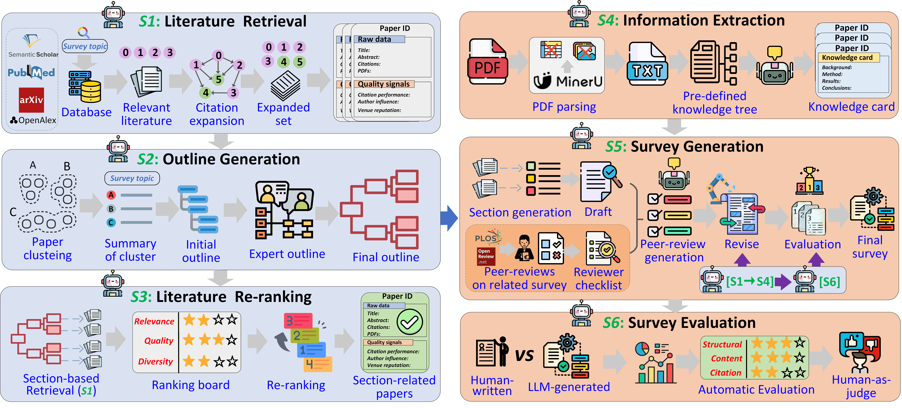

# SurveyAgent-HKA: A Multi-Agent Framework for Scientific Survey Generation with LLMs and Human Knowledge Augmentation

<p align="center">
  
</p>

This is the official repository for the code of the paper: ["SurveyAgent-HKA: A Multi-Agent Framework for Scientific Survey Generation with LLMs and Human Knowledge Augmentation"](https://arxiv.org/abs/2609.05938), *accepted at **Knowledge-Based Systems***.

## Overview

* We propose SurveyAgent-HKA, a multi-agent framework that integrates human Knowledge foe end-to-end scientific survey generation.

* We designed a unified literature retrieval pipeline, which not only helps retrieve relevant literature from multiple sources but also selects representative papers through advanced citation network analysis and a re-ranking module, ensuring the coverage and reliability of the references for generating well-grounded scientific surveys.

* We introduce two types of human knowledge augmentation for automatic survey generation. Hierarchical outlines extracted from human-written surveys provide structural guidance for outline construction, while real peer-review comments support targeted multi-round revision. To the best of our knowledge, this is the first work to use real review feedback from published survey papers to guide automatic survey revision.

* Experiments on two domains show that the surveys generated by our model outperform mainstream baselines in citation quality, structural consistency, and content quality, with each module in SurveyAgent-HKA contributing to the overall performance. 


## Project Structure

```text
SurveyAgent-HKA/
├── Peer_review_comments/               # Human peer-reviews used during revision
└── code_for_SurveyAgent-HKA/
    ├── config.json                     # Topic, API, retrieval, model, and runtime configuration
    ├── requirements.txt                # Complete Python dependency list
    ├── database.zip                    # External AutoSurvey arXiv vector database
    ├── Surveys_Full_Text.jsonl         # External SurveyGen full-text survey corpus
    └── src/
        └── surveyagent_hka/
            ├── __init__.py             # Package initialization
            ├── __main__.py             # python -m surveyagent_hka entry point
            ├── cli.py                  # run, status, validate-config, and test-llm commands
            ├── config.py               # Configuration schemas, validation, and path resolution
            ├── models.py               # Paper, outline, section, and survey data models
            ├── pipeline.py             # End-to-end orchestration and checkpoint resume logic
            ├── router.py               # Bounded parallel task routing between agents
            ├── retrieval.py            # Search, filtering, citation expansion, and OpenAlex enrichment
            ├── local_arxiv.py          # AutoSurvey database loading, caching, vector search, and GPU support
            ├── embeddings.py           # Text embeddings, similarity calculation, and clustering
            ├── ranking.py              # Quality-aware paper scoring and ranking
            ├── human_knowledge.py      # Published-survey structures and peer-review data loading
            ├── outline.py              # Cluster summarization and human-guided outline generation
            ├── extraction.py           # PDF download, MinerU parsing, and knowledge-card extraction
            ├── writing.py              # Citation planning, subsection drafting, and citation validation
            ├── review.py               # Review, revision, chunked polishing, and failure fallback
            ├── prompts.py              # Structured prompts used by all LLM agents
            ├── llm.py                  # OpenAI-compatible client, retries, and JSON response parsing
            ├── storage.py              # Artifact, checkpoint, and agent-event persistence
            └── progress.py             # Console stage messages and progress bars
```

## Code for SurveyAgent-HKA
**Before start:**

1. Apply for the [Semantic Scholar API](https://www.semanticscholar.org/product/api), [OpenAlex API](https://docs.openalex.org/how-to-use-the-api/api-overview), and an OpenAI-compatible GPT API.

2. Download `Surveys_Full_Text.jsonl` from [SurveyGen](https://github.com/tongbao96/SurveyGen) and place it next to `config.json`.

3. Download `database.zip` from [AutoSurvey](https://github.com/AutoSurveys/AutoSurvey) and place it next to `config.json`.

4. Configure all required API keys and related parameters in `config.json`.

**Quick start:**

1. Create and activate a conda environment:

   ```bash
   conda create -n surveyagent-hka python=3.11 -y
   conda activate surveyagent-hka
   ```

2. Install SurveyAgent-HKA:

   ```bash
   cd path/to/code_for_SurveyAgent-HKA
   python -m pip install -r requirements.txt
   python -m pip install -e . --no-deps
   ```

3. Open `config.json` and configure the survey topic, API keys, and OpenAI-compatible GPT endpoint.

4. Check the configuration:

   ```bash
   surveyagent-hka validate-config
   surveyagent-hka test-llm
   ```

5. Run the complete pipeline, the same command automatically resumes an interrupted run from completed checkpoints:

   ```bash
   surveyagent-hka run
   ```

6. To inspect the current state or restart the entire pipeline:

   ```bash
   surveyagent-hka status
   surveyagent-hka run --no-resume
   ```

## Key Parameters


* `retrieval.sources` — Selects the active literature sources. More sources improve coverage but increase retrieval time and API requests.

* `retrieval.use_arxiv_api` — `true` uses the live arXiv API; `false` searches the local AutoSurvey `database.zip`, then links the results to OpenAlex.

* `retrieval.initial_total`, `section_results`, `final_per_section` — Control the number of papers retrieved and retained. Larger values increase time, memory use, and downstream context size.

* `download_pdfs` — `false` uses abstracts only; `true` downloads PDFs, runs MinerU, and extracts full-text knowledge cards, which is substantially slower.

* `max_full_text_papers` — Limits how many PDFs are processed when `download_pdfs` is `true`.

* `parallel_enabled` — `true` enables bounded parallel agent tasks; `false` forces sequential execution and is slower but easier to debug.

* `retrieval_workers`, `section_workers`, `max_workers`, `polish_workers`, `model.max_concurrent_requests` — Set concurrency limits. Higher values may reduce runtime but increase API pressure and rate-limit risk.

* `max_revision_rounds` — Limits Reviewer-Refiner iterations. More rounds can improve the draft but add LLM calls and runtime.


## Output

All intermediate results, checkpoints, and generated surveys are saved under the `workspace` specified in `config.json`:

```text
<workspace>/
├── artifacts/
│   ├── initial_papers.json
│   ├── outline.json
│   ├── ranked_papers_by_section.json
│   ├── extracted_papers_by_section.json
│   ├── citation_plan.csv
│   ├── citation_plan.json
│   ├── skipped_papers.json
│   ├── draft_survey.md
│   ├── optimal_revised_survey.md
│   └── final_survey.md
├── documents/
├── events.jsonl
└── state.json
```

The final generated survey is saved as `artifacts/final_survey.md`.

## Acknowledgements

We thank the authors of [AutoSurvey](https://github.com/AutoSurveys/AutoSurvey) for releasing the pre-encoded arXiv paper database.

## Citation

If you use this code, please cite the following works:

```bibtex
@article{bao2026surveyagenthka,
  author  = {Tong Bao and Mir Tafseer Nayeem and Yi Zhao and Davood Rafiei and Chengzhi Zhang},
  title   = {SurveyAgent-HKA: A Multi-Agent Framework for Scientific Survey Generation with LLMs and Human Knowledge Augmentation},
  year    = {2026},
  note    = {Accepted by Knowledge-Based Systems}
}

@article{wang2024autosurvey,
  title   = {AutoSurvey: Large Language Models Can Automatically Write Surveys},
  author  = {Wang, Yidong and Guo, Qi and Yao, Wenjin and Zhang, Hongbo and Zhang, Xin and Wu, Zhen and Zhang, Meishan and Dai, Xinyu and Zhang, Min and Wen, Qingsong and others},
  journal = {Advances in Neural Information Processing Systems},
  volume  = {37},
  pages   = {115119--115145},
  year    = {2024}
}
```
